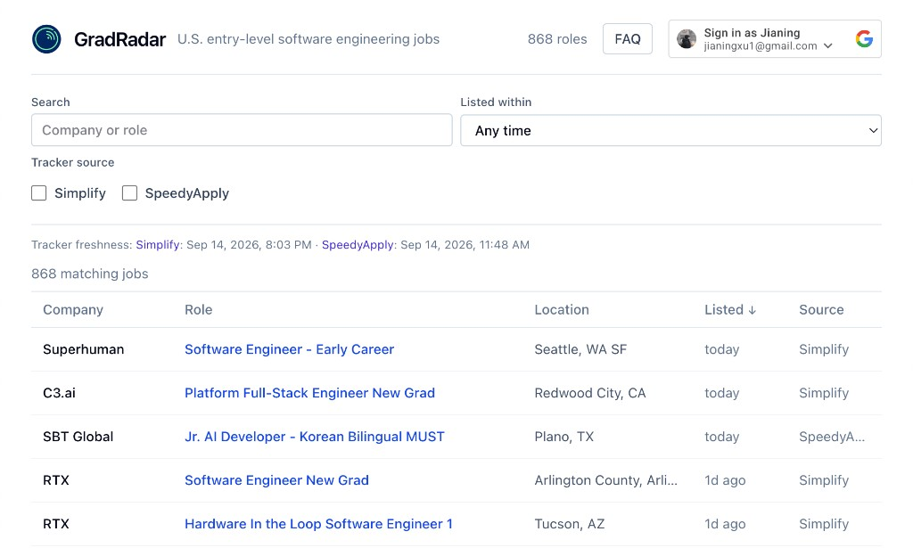

  <h1>GradRadar</h1>
  

    GradRadar helps U.S. new grads find software engineering roles early by bringing the newest listings from multiple job trackers into one place.
  

  
  

    <a href="https://gradradar-web.vercel.app">Live website</a>  
  

## Why I built this

As a CS student looking for new-grad positions, I kept hearing the same advice: apply early. Once a role has thousands of applications, getting an interview is hard; so applying early is essential.

I built GradRadar so I could check one place for the latest, deduplicated new grad job listings instead of manually refreshing several trackers. The goal is also to send opt-in Telegram alerts, so we don't miss an opportunity because we saw it too late.

## Tech stack

- **Frontend:** React, TypeScript, Vite, Tailwind CSS
- **Backend:** Python, FastAPI, SQLAlchemy, Pydantic
- **Data and jobs:** PostgreSQL/Supabase, GitHub API, HTTPX, APScheduler
- **Testing:** pytest, respx, Vitest, Testing Library

## What it does

- Ingests new-grad SWE listings from the [SpeedyApply](https://github.com/speedyapply/2027-SWE-College-Jobs) and [Simplify](https://github.com/SimplifyJobs/New-Grad-Positions) GitHub trackers.
- Keeps clearly U.S.-eligible roles, normalizes application URLs, and uses those URLs to deduplicate the same job across sources.
- Stores the result and displays it in a searchable, filterable website with the original application link and tracker source.
- Lets signed-in users opt in to private Telegram alerts. Alerts begin only after
  connection confirmation and never backfill old jobs.

## Roadmap

- [x] Ingest the SpeedyApply and Simplify new-grad trackers.
- [x] Filter clearly U.S.-eligible SWE roles and normalize application links.
- [x] Deduplicate listings by normalized application URL while retaining their tracker source.
- [x] Build a searchable, filterable web feed and a read-only API.
- [x] Add optional Google sign-in.
- [x] Run the ingestion worker and database reliably in production, with health monitoring. [DONE]
- [ ] [IN PROGRESS] Build opt-in Telegram alerts with connection confirmation, unsubscribe,
  retries, and duplicate-safe outbox delivery.
- [ ] Add other notification channels.
- [ ] Ingest postings directly from ATS platforms such as Ashby and Greenhouse.
