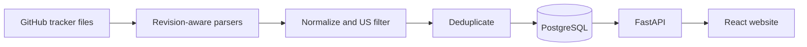

# GradRadar system design

## 1. Product goal and MVP boundary

GradRadar helps candidates find **new, US-based, entry-level software
engineering jobs** shortly after they are added to configured community job
trackers. Each result provides the application link supplied by the tracker,
the company, title,
location, the tracker-reported age, and when GradRadar first saw it.

The target audience is full-time SWE new-grad roles for 2026 or 2027
bachelor's/master's graduates. Exclude PhD-specific roles.

The first release is a public, read-only web/API product with no user accounts.
It ingests only two
GitHub repositories, does not verify that employers still list a job, create accounts,
track applications, scrape LinkedIn, submit applications, or send individual
alerts. It should establish reliable source ingestion and useful browsing
before adding subscriptions.

### Product decisions

| Decision | Choice | Why |
| --- | --- | --- |
| MVP source of truth | The two configured GitHub files | Smallest useful scope; every displayed row is traceable to a source revision. |
| Source repos | SpeedyApply USA file and Simplify SWE table | Both have a maintained job table and direct apply links. |
| Storage | PostgreSQL | Durable dedupe, history, filtering, and subscriptions. |
| API | FastAPI | Matches the Python ingestion service and provides typed OpenAPI docs. |
| Web UI | React + TypeScript | Best fit for a responsive, filterable public feed. |
| First alert channel, after MVP | Telegram bot | Free, supports opt-in user chats, and is simple to ship. |
| Later alert channel | Discord bot, then email | Discord webhooks are ideal for a shared channel; per-user delivery needs a bot. |
| Do not support in MVP | Alerts, WhatsApp, and iMessage | Prove the feed before introducing notification complexity. |

Telegram's bot platform is free for users and developers. Discord incoming
webhooks are useful for broadcasting into one channel but do not provide
user-specific subscription management, so that needs a bot/OAuth flow when we
add it. [Telegram](https://core.telegram.org/bots),
[Discord](https://docs.discord.com/developers/platform/webhooks)

## 2. System shape

Each GitHub parser reads only a changed source revision, extracts its selected
job table, normalizes the result, applies the US filter, and upserts it. A new
eligible job is made available through the API and website.

This cleanly separates three different facts:

- **Provenance:** a configured GitHub tracker mentioned the role at a specific
  commit SHA.
- **Normalized job:** GradRadar's current record, potentially observed in both
  source repositories.

## 3. Ingestion and replication model

### Source registry

The registry has exactly two enabled source files for the MVP:

- [`speedyapply/2027-SWE-College-Jobs`](https://github.com/speedyapply/2027-SWE-College-Jobs),
  `main`, `NEW_GRAD_USA.md`
- [`SimplifyJobs/New-Grad-Positions`](https://github.com/SimplifyJobs/New-Grad-Positions),
  `dev`, `README.md`, Software Engineering section only

Each source has its GitHub owner/repository, branch, file path, parser name,
enabled state, last fetched commit/blob SHA, last checked time, and failure
count. Fetch source metadata first; download and parse the raw file only when
the SHA changes. This makes the scheduled run cheap and repeatable.

The parsers are intentionally separate because the formats differ:

- **SpeedyApply:** Markdown tables with company, position, location, salary,
  application link, and age.
- **Simplify:** HTML `<table>` rows inside Markdown; company cells may be blank
  `↳` continuation rows and application cells include both an apply link and a
  Simplify link. Prefer the link marked Apply and inherit the prior
  company for continuation rows.

### Polling rules

- Check both source files every 10 minutes using their commit/blob SHA; parse
  only changed files.
- Use conditional requests/ETags where GitHub provides them and add jitter.
- Use bounded retries with exponential backoff. One failing source must not halt
  the run.
- Record each fetch attempt and its outcome for debugging.
- Treat a parse as successful only if the expected table is found and basic
  sanity checks pass. For example, an unexpected 90% row-count drop is a
  source-format failure, not evidence that 90% of jobs disappeared.
- Mark a source row not present after it is absent from a successfully parsed,
  validated source revision. A job becomes absent only when every source row
  that points to it is not present. Preserve historical jobs and show current
  jobs by default.

### Idempotency and deduplication

For source-specific tracking, every parsed row has a unique
`source_id + source_row_key`. Derive `source_row_key` from a normalized apply
URL; if it is unavailable, use a stable hash of company, title, location, and
the source row content. A source row upsert changes `last_seen_at` and the raw
row snapshot; the initial insert sets `first_seen_at`.

Deduplicate across the two sources only when normalized application URLs match.
Normalization removes fragments and known tracking parameters such as `utm_*`
and `ref`, while preserving job-identifying parameters such as `gh_jid`. For
the MVP, do not use fuzzy title/company/location matching; keep uncertain
lookalikes visible rather than accidentally hiding a real role.

## 4. Core data model

| Table | Important fields | Purpose |
| --- | --- | --- |
| `sources` | `id`, repository/file identity, parser, last SHA | The two GitHub tracker files. |
| `fetch_runs` | source, timestamps, SHA, status, error | Operational audit trail. |
| `source_rows` | source row key, raw row, reported age, first/last seen | One parsed row from a particular tracker. |
| `jobs` | normalized apply URL, title, company, locations, first/last seen, status | Current normalized job state. |
| `job_provenance` | job, source row, source URL, commit SHA | Explains precisely where a role came from. |

`jobs.locations` should retain the source text and also expose a normalized
searchable value. A job is `current` when at least one current source row
references it, otherwise `absent`. Retained source data makes later re-parsing
and source-format migrations possible.

The application URL is **source-supplied, not employer-verified**. The UI must
link to the source document revision and label the external button "Open
application link" rather than claim it is an active official posting.

## 5. Matching rule

The product target is intentionally narrow:

1. **US scope:** include US cities, `United States`, and US-eligible remote;
   exclude explicitly non-US-only roles.
2. **Engineering family:** ingest only the SpeedyApply new-grad USA file and
   Simplify's Software Engineering section; do not add our own role-title
   classifier in the first milestone.
3. **New-grad level:** trust the source category in the first milestone. The
   UI must identify the source so users understand this is source-curated data.
   Include 2026 and 2027 bachelor's/master's new-grad roles; exclude
   PhD-specific roles.

Apply a deterministic US filter: keep clearly US locations and `Remote, US`;
exclude clearly non-US locations. Unknown/mixed locations should be stored as
`location_uncertain` and excluded from the public default feed until we review
them. No LLM is needed for the MVP.

## 6. API and website MVP

### Public API

- `GET /health` — service and database health.
- `GET /v1/jobs` — paginated feed; filters: `q`, `location`, `remote`,
  `posted_within_hours`, `company`, and `sort=newest`.
- `GET /v1/jobs/{job_id}` — full job, source provenance, and application link.
- `GET /v1/metadata` — filter values and most recent ingestion time.

`posted_within_hours` filters on `first_seen_at`; the UI should label it
"Found by GradRadar" rather than implying it is the employer's published
timestamp. Show the source's supplied age separately as "Tracker says: 3d".

### Initial UI

One page is enough: freshness timestamp, search, location/remote filters, and
a newest-first job list. Each card shows company, role, location,
tracker-reported age, GradRadar first-seen time, source, and an **Open
application link** button. Preserve query filters in the URL so a filtered feed
can be shared.

The Markdown dashboard is a generated read-only artifact, not a second source
of truth. A scheduled export can write `docs/latest-jobs.md` from the database
for GitHub visibility, but the API/database owns the state.

## 7. Notifications after the web MVP

This is deliberately out of scope until the feed works. Telegram is the first
implementation. A user opens the bot, sends `/start`,
and then selects basic preferences (US location/remote and immediate vs digest).
The service stores the Telegram chat ID only after that opt-in. When a job
first enters the public feed, it creates one outbox record per matching active
subscriber. A worker sends the message and records success/failure; retries
must reuse the same outbox row so a job is not repeatedly announced.

Start with a global US-new-grad feed and either no preferences or just remote
vs on-site. Do not build free-form keyword alerts, WhatsApp, Discord, and
iMessage together. That is product surface without proving the core feed is
accurate.

## 8. Phased implementation plan

### Phase 0 — validate the input (1–2 days)

- Register the two supplied GitHub files and pin their branches/paths.
- Save representative raw rows: normal role, Canada role, US remote, and a
  Simplify continuation row.
- Define expected normalized output for those fixtures.
- Defer the deployment provider decision; it is not needed to validate parsing.

Exit criterion: both source files can be fetched at a specific SHA and the
fixture rows have an agreed expected result.

### Phase 1 — reliable ingestion (first code milestone)

- Set up SQLAlchemy models, Alembic migrations, settings, and structured logs.
- Implement both source parsers and focused fixtures/tests.
- Add source registry, fetch-run history, SHA-aware fetches, source-row upserts,
  URL-based dedupe, provenance storage, and absent-job handling.

Exit criterion: rerunning the same source SHA produces no writes or duplicate
jobs, and a changed source row updates exactly one record.

### Phase 2 — eligibility and public API

- Implement US-location filtering with reason codes.
- Add review fixtures for US, non-US, and uncertain locations.
- Implement the public API, pagination, filters, and OpenAPI documentation.
- Generate `docs/latest-jobs.md` from the API/database for an inspectable
  dashboard.

Exit criterion: the API returns only US roles from the selected source sections,
explains its source, and exposes the source-supplied application URL.

### Phase 3 — website

- Build the React/TypeScript read-only feed against the API.
- Add URL-backed filters, empty/error states, accessibility basics, and a
clearly labeled freshness timestamp.
- Deploy API, worker/scheduler, PostgreSQL, and static frontend; add health
  monitoring.

Exit criterion: a public user can find a recent role and open its
source-supplied application link in one click.

### Phase 4 — subscriptions (not part of MVP)

- Build Telegram `/start`, consent, preferences, unsubscribe, and delivery
  worker.
- Add `subscribers`, `notification_outbox`, and `notification_deliveries`
  tables only in this phase.
- Add notification outbox/idempotency, rate limiting, retries, and opt-out.
- Measure duplicate-alert and delivery-failure rates before adding Discord.

Exit criterion: a test subscriber receives one alert for one newly eligible
job and no alert when the same job is seen again.

### Phase 5 — coverage and quality

- Add a small human review queue for uncertain locations and source failures.
- Decide whether official ATS verification is worth adding for sources that
  prove inaccurate or slow.
- Track freshness, source health, duplicates, source disagreement, and alert
  latency.

Exit criterion: coverage expands without weakening source provenance, stable
dedupe, and idempotent-notification guarantees.

## 9. Requirements to keep us honest

### Functional requirements

- User can browse current matching jobs without creating an account.
- User can filter jobs by keyword, US location, remote status, company, and
  how recently GradRadar found them.
- User can open the source-supplied application link and the source document
  revision for every displayed job.
- User can see the source, tracker-reported age, and when GradRadar first
  observed a role.
- An operator can add, disable, and inspect a source file without code changes.

### Non-functional requirements

- The system should be able to detect a change to an onboarded source file
  within 10 minutes under normal operation.
- The system should be able to ingest repeated fetches idempotently and avoid
  duplicate job records and alerts.
- The system should be able to continue processing healthy sources when one
  source fails and expose its failure state.
- The system should be able to explain each displayed job with a source URL,
  source revision, and stored raw row.
- The system should be able to reject a malformed or suspiciously incomplete
  source revision without removing currently displayed jobs.
- The system should be able to store secrets only in environment configuration,
  never in source control or the public API.

## 10. Open decisions before coding

1. Is `remote in the US` eligible, and should location filters include visas or
   sponsorship only as a later metadata field?
2. Where do you want to deploy? A simple first choice is one API/worker service,
   managed Postgres, and a static frontend; the exact provider can wait until
   Phase 3.
